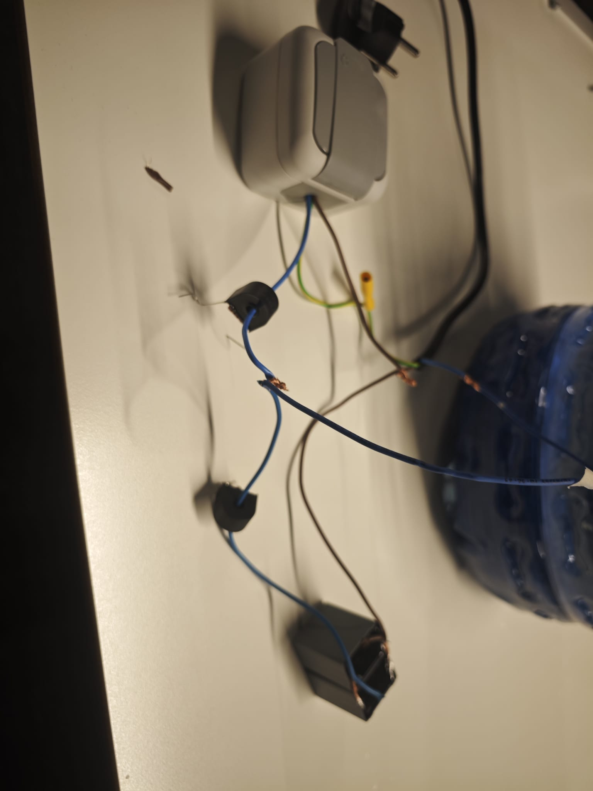
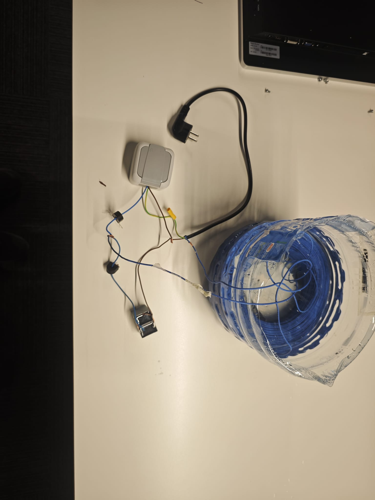
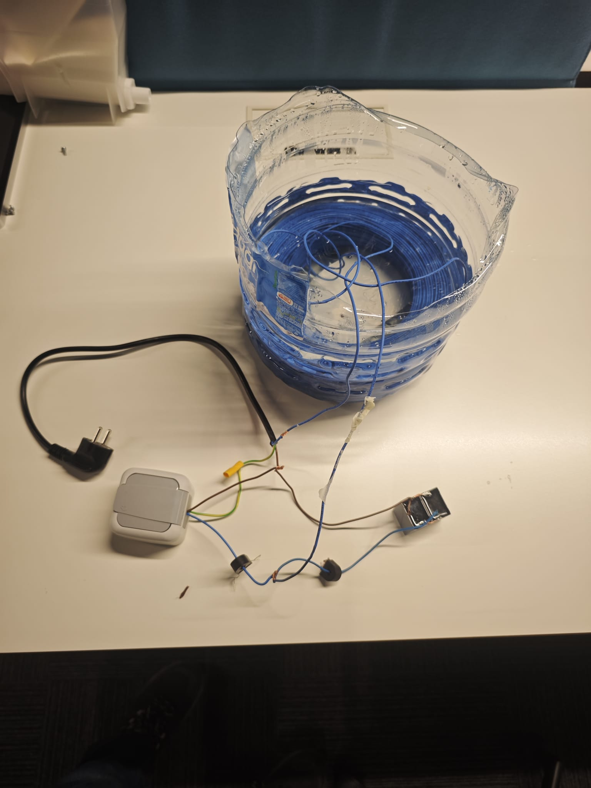

# ⚡ DIY Harmonic Analyzer — Grid-Isolated THD Measurement via KCL

# ⚡ DIY Harmonik Analizör — KCL ile Şebekeden İzole THD Ölçümü


> _A full-stack power quality measurement system built from first principles — without a $30,000 AC grid simulator._
>
> _Temel fizik yasalarından yola çıkarak, 30.000$'lık şebeke simülatörü olmadan geliştirilmiş tam donanımlı bir güç kalitesi ölçüm sistemi._

---

## 🎯 The Problem / Problem

**EN:** Testing a device for harmonic emission (IEC 61000-3-2) requires a **clean sinusoidal reference voltage**. The real-world grid is never clean — it carries pollution from every other device on the network. If you measure your DUT's harmonics directly from the grid, you are measuring the grid's dirt, not your device.

**TR:** IEC 61000-3-2 standardına göre harmonik emisyon testi yapabilmek için **temiz bir sinüs kaynağı** gereklidir. Gerçek şebeke hiçbir zaman temiz değildir — diğer cihazların kirliliğini taşır. DUT'u doğrudan şebekeden ölçerseniz, cihazınızın değil şebekenin kirliliğini ölçmüş olursunuz.

---

## 🧠 Two Core Ideas / İki Temel Fikir

---

### Part 1 / Bölüm 1 — A €2 Current Probe (CT + 100Ω Burden Resistor) / €2'lik Akım Probu

**EN:** A standard oscilloscope cannot measure AC current directly. A current transformer (CT) with a **burden resistor** across its secondary terminals solves this instantly.

**TR:** Standart bir osiloskop doğrudan AC akım ölçemez. Çözüm: Akım trafosunun (CT) sekonder terminallerine bağlanan bir **yük direnci (burden resistor)**.

```
AC Hat ──[CT 5A]──
                 |
               100Ω   ← V_ölçüm / V_measured
                 |
               GND
```

**Formül / Formula:**

```
V_measured = I_line × (1/ratio) × R_burden
Ölçek / Scale:  5A → 0.25V  →  duyarlılık / sensitivity = 20 A/V
```

Galvanik olarak **izole**, osiloskop uyumlu bir akım probu. Yazılım `ratio = 20 A/V` dönüşümünü otomatik uygular.

_A galvanically **isolated**, oscilloscope-compatible current probe. The software applies the `ratio = 20 A/V` factor automatically._

---

### Part 2 / Bölüm 2 — Building a Grid-Isolated Harmonic Lab / Şebekeden İzole Harmonik Lab Kurulumu

#### Step 2a / Adım 2a — LC Low-Pass Filter (DIY Reactor) / LC Alçak Geçiren Filtre (DIY Reaktör)

**EN:** Instead of buying an industrial reactor, a **300-metre, 0.75mm² copper cable reel** is used as-is (without unwinding). Its natural inductance is approximately **45 mH**. Two 22 µF capacitors in parallel give **44 µF**.

**TR:** Endüstriyel reaktör satın almak yerine, piyasada kolayca bulunan **300 metre × 0.75 mm² bakır kablo makarası** çözülmeden kullanılmıştır. Doğal endüktansı yaklaşık **45 mH**'dir. 2 × 22 µF kapasitör paralel bağlanmıştır → **44 µF**.

$$f_c = \frac{1}{2\pi\sqrt{LC}} = \frac{1}{2\pi\sqrt{0.045 \times 0.000044}} \approx \mathbf{113 \text{ Hz}}$$

**EN:** The filter passes 50 Hz and **blocks harmonics above 113 Hz** — cleaning the grid before it reaches the DUT.

**TR:** Filtre 50 Hz'i geçirir, **113 Hz üzerindeki harmonikleri engeller** — DUT'a ulaşmadan önce şebekeyi temizler.

$$Z_0 = \sqrt{\frac{L}{C}} = \sqrt{\frac{0.045}{0.000044}} \approx \mathbf{32\ \Omega}$$

---

#### Step 2b / Adım 2b — The Cooling Problem / Isınma Problemi

**EN:** 300 metres of 0.75mm² cable dissipates significant heat under load. Solution: the reel is **submerged in a 19-litre water bottle** (cut open) — passive thermal management using water's high heat capacity.

**TR:** 300 metre kablo yük altında ciddi ısı üretir. Çözüm: Makara, **kesilmiş 19 litrelik bir su damacanasının** içine yerleştirilmiştir. Suyun yüksek ısıl kapasitesi ile pasif soğutma sağlanmıştır.

---

#### Step 2c / Adım 2c — The Impedance Wall & Capacitor as a Source / Empedans Duvarı ve Kapasitörün Kaynak Olması

**EN:** The massive 45 mH inductor acts as an impedance wall at high frequencies. It prevents the device from drawing its required harmonic currents from the grid. Because of this blockage, the parallel-connected **capacitor becomes the local AC source** providing those harmonic currents.

**TR:** Devasa 45 mH bobin, yüksek frekanslarda bir empedans duvarı görevi görerek cihazın şebekeden harmonik akım çekmesini tamamen engeller. Bu engelleme yüzünden, paralel bağlanan **kapasitör yüksek frekanslı akımlar için bir "akım kaynağı" haline gelir**.

| Frekans / Frequency       | X_L (bobin/inductor) | X_C (kapasitör/capacitor) | Akım yolu / Current path                                                         |
| ------------------------- | -------------------- | ------------------------- | -------------------------------------------------------------------------------- |
| 50 Hz (temel/fundamental) | 14.1 Ω               | 72.3 Ω                    | Ana enerjiyi şebeke (L üzerinden) sağlar / Grid provides mains power via L       |
| 250 Hz (5. Harmonik/5th)  | **70.7 Ω**           | **14.4 Ω**                | Kapasitör (C) harmonik akım kaynağı olur / Capacitor (C) acts as harmonic source |

**KCL (Kirchhoff) düğüm denklemi / KCL Node equation:**

$$I_{\text{DUT harmonikleri}} = I_{\text{giriş}} - I_{\text{kapasitör}}$$
$$I_{\text{DUT harmonics}} = I_{\text{input}} - I_{\text{capacitor}}$$

**EN:** CH1 CT measures `I_input`, CH2 CT measures the changing `I_capacitor`. The software subtracts them digitally ($CH1 - CH2$) to reconstruct the DUT's **pure harmonic signature**, completely isolated from grid pollution.

**TR:** CH1 CT `I_giriş`'i (şebeke), CH2 CT `I_kapasitör`'ü ölçer. Yazılım bu iki sinyali dijital olarak çıkartarak ($CH1 - CH2$) DUT'un şebeke kirliliğinden arındırılmış **saf harmonik imzasını** elde eder.

---

## 📊 System Diagram / Sistem Diyagramı

```
        Şebeke / Grid (220V AC — kirli/dirty)
                     │
              [LC Filtresi / Filter]      fc = 113 Hz
              L = 45mH (kablo makara / cable reel)
              C = 44µF                   ← Su soğutma / Water-cooled
                     │
                  Düğüm A ────────── [CT1 → 100Ω → CH1]  I_giriş / I_input
                  Node A
             ┌────────┴────────┐
         [Kapasitör C]       [DUT]
         [CT2→100Ω→CH2]
          I_kapasitör / I_capacitor

  DSP:  I_DUT_harmonikleri = CH1 − CH2   (Kirchhoff Akım Yasası / KCL)
  FFT  →  THD, TDD, IEC 61000-3-2 Class A  PASS / FAIL
```

---

## 📸 Hardware Gallery / Donanım Galerisi

|                                                                 |                                                            |
| --------------------------------------------------------------- | ---------------------------------------------------------- |
|                                         |                             |
| CT problar + 100Ω yük dirençleri / CT probes + burden resistors | 300m kablo makarası su soğutmalı / 300m reel, water-cooled |
|                                         |                                  |
| Yan görünüm / Side view                                         | Tam sistem / Full system                                   |

---

## 🖥️ Software / Yazılım

**EN:** The Python GUI reads dual-channel oscilloscope `.csv` exports and performs full DSP analysis.

**TR:** Python GUI, çift kanallı osiloskop `.csv` dosyalarını okuyarak DSP analizi yapar.

| Özellik / Feature                         | Detay / Detail                                                              |
| ----------------------------------------- | --------------------------------------------------------------------------- |
| Çift kanal CSV / Dual-channel CSV         | Rigol formatı, senkronize CH1 + CH2                                         |
| Akım ölçekleme / Current scaling          | Kanal başına A/V oranı / Per-channel A/V ratio (varsayılan/default: 20 A/V) |
| Dijital filtreleme / Digital filtering    | Butterworth, Savitzky-Golay, Hareketli ortalama / Moving average            |
| Diferansiyel sinyal / Differential signal | `CH1 − CH2` yazılımda / computed in software                                |
| FFT analizi / FFT analysis                | `scipy.fft`, 40. harmoniğe kadar / up to harmonic 40                        |
| Metrikler / Metrics                       | THD, TDD, RMS, Crest Factor, Power Factor                                   |
| IEC 61000-3-2 Class A                     | Otomatik PASS/FAIL her harmonik için / Auto PASS/FAIL per harmonic          |
| Batch işlem / Batch processing            | Birden fazla CSV tek seferde / Multiple CSV files in one run                |
| Dışa aktarım / Export                     | PNG grafik, TXT rapor, CSV harmonik tablosu                                 |

---

## 🚀 Quick Start / Hızlı Başlangıç

```bash
# Bağımlılıkları yükle / Install dependencies
pip install pandas numpy scipy matplotlib opencv-python pillow

# Uygulamayı başlat / Launch the analyzer
python analyzer_main.py
```

**TR — Kullanım Akışı:**

1. CH1 CT'yi giriş düğümüne, CH2 CT'yi kapasitör dalına bağla
2. Osiloskoptan `.csv` kaydet
3. Dosyayı yükle → ratio = `20 A/V` → **ANALİZ ET**
4. DIFF kanalı DUT'un izole harmonik imzasını gösterir
5. IEC PASS/FAIL raporunu dışa aktar

**EN — Workflow:**

1. Connect CH1 CT to the line input node, CH2 CT to the capacitor branch
2. Record oscilloscope data as `.csv`
3. Load the file → set ratio to `20 A/V` → click **Analyse**
4. The DIFF channel shows the DUT's isolated harmonic signature
5. Export IEC PASS/FAIL report (H1–H40)

---

## 🔬 Why This Matters / Neden Önemli

**EN:** This setup replicates the **core function of a professional EMC pre-compliance lab** using basic electrical theory (impedance, KCL), off-the-shelf components, and open-source Python DSP. It demonstrates that rigorous engineering does not require expensive equipment — it requires understanding the physics.

**TR:** Bu kurulum, temel elektrik teorisi (empedans, KCL), kolayca bulunabilen bileşenler ve açık kaynaklı Python DSP kullanarak **profesyonel bir EMC ön-uyumluluk laboratuvarının temel işlevini** yerine getirmektedir. Titiz mühendislik için pahalı ekipmana değil, fiziği anlamaya ihtiyaç vardır.

---

## 📄 License / Lisans

MIT — Kullanımı, değiştirmesi ve üzerine inşa etmesi serbesttir / Free to use, modify, and build upon.
